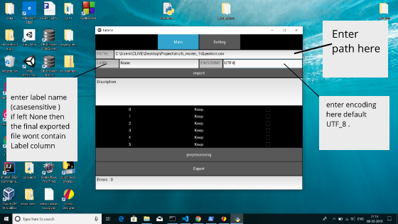
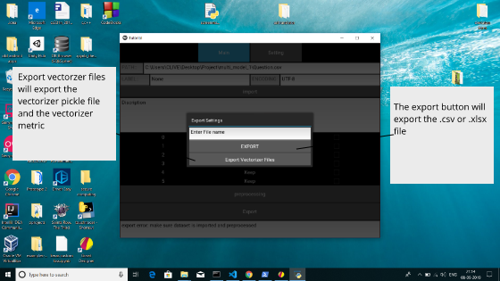

# Web App  [added in 2020] 
Created a  webapp using streamlit, has the same features as the desktop app, the app is hosted on heroku. 

Url : https://nlpallinone.herokuapp.com/
there are some bugs in the webapps which will be fixed shortly.

# NLP-APP
A simple python app made with kivy that combines all the basic nlp preprocessing  need to start with nlp task.
### pre-prequisites
install kivy  https://kivy.org/doc/stable/installation/installation-windows.html

install nltk using <code>pip install nltk</code>

install sklearn using <code>pip install sklearn</code>

install pandas 

install pickle

### To run the application enter the below command in the terminal
<code>python mini_nlp_1.py
</code>

## Note the extended stopwords are taken form : https://github.com/6/stopwords-json (english)

Along with that it has filters to remove punctuations.
code is given below
<code>
        input =  re.sub('[!@#$%^&*()\n_:><?\-.{}|+-,;""``~`—]|[0-9]|/|=|\[\]|\[\[\]\]',' ',input)
        input = re.sub('[“’\']','',input)   
</code>

###### Note :- due to some problems  with  PyInstaller failing in importing  nltk_data i could not create the .exe file 

<h1>A Quick User Guide</h1> 

### STEP 1

## Remember that if label is kept None The exported file wont contain the label column

### STEP 2

### STEP 3

### Settings Screen 
this screen allows one to play around with the different settings and see what happend when different settings are applied.

.png)

Feature work:
1 improve the user interface 
2 add more features any suggestions are welcomed in the comments 
3 create .exe file in the feature 
4 create  a exportable file  for muli col files 
